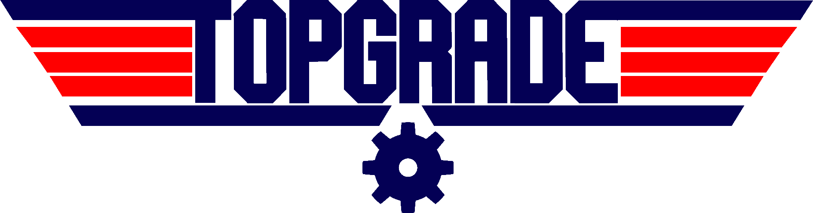

  <h1>
    
  </h1>
  
  
  
  
  

  

  
## Introduction

> **Note**
> This is a fork of [topgrade by r-darwish](https://github.com/r-darwish/topgrade) to keep it maintained.

Keeping your system up to date usually involves invoking multiple package managers.
This results in big, non-portable shell one-liners saved in your shell.
To remedy this, **Topgrade** detects which tools you use and runs the appropriate commands to update them.

## Installation

- Arch Linux: [AUR](https://aur.archlinux.org/packages/topgrade)
- NixOS: [Nixpkgs](https://search.nixos.org/packages?show=topgrade)
- Void Linux: [XBPS](https://voidlinux.org/packages/?arch=x86_64&q=topgrade)
- macOS: [Homebrew](https://formulae.brew.sh/formula/topgrade) or [MacPorts](https://ports.macports.org/port/topgrade/)

Other systems users can either use `cargo install` or the compiled binaries from the release page.
The compiled binaries contain a self-upgrading feature.

Topgrade requires Rust 1.51 or above.

## Usage

Just run `topgrade`.

Visit the documentation at [topgrade-rs.github.io](https://topgrade-rs.github.io/) for more information.

> **Warning**
> Work in Progress

## Customization

See `config.example.toml` for an example configuration file.

### Configuration Path

The configuration should be placed in the following paths depending on the operating system:

- **Windows** - `%APPDATA%/topgrade.toml`
- **macOS** and **other Unix systems** - `${XDG_CONFIG_HOME:-~/.config}/topgrade.toml`

## Remote Execution

You can specify a key called `remote_topgrades` in the configuration file.
This key should contain a list of hostnames that have Topgrade installed on them.
Topgrade will use `ssh` to run `topgrade` on remote hosts before acting locally.
To limit the execution only to specific hosts use the `--remote-host-limit` parameter.

## Contribution

### Problems or missing features?

Open a new issue describing your problem and if possible provide a solution.

### Missing a feature or found an unsupported tool/distro?

Just let us now what you are missing by opening an issue.
For tools, please open an issue describing the tool, which platforms it supports and if possible, give us an example of its usage.

### Want to contribute to the code?

Just fork the repository and start coding.

### Contribution Guidelines

- Check if your code passes `cargo fmt` and `cargo clippy`.
- Check if your code is self explanatory, if not it should be documented by comments.
- Make a pull request to the `dev` branch for new features or to the `bug-fixes` branch for bug fixes.

## Roadmap

- [ ] Add a proper testing framework to the code base.
- [ ] Add unit tests for package managers.
- [ ] Split up code into more maintainable parts, eg. putting every linux package manager in a own submodule of linux.rs.
